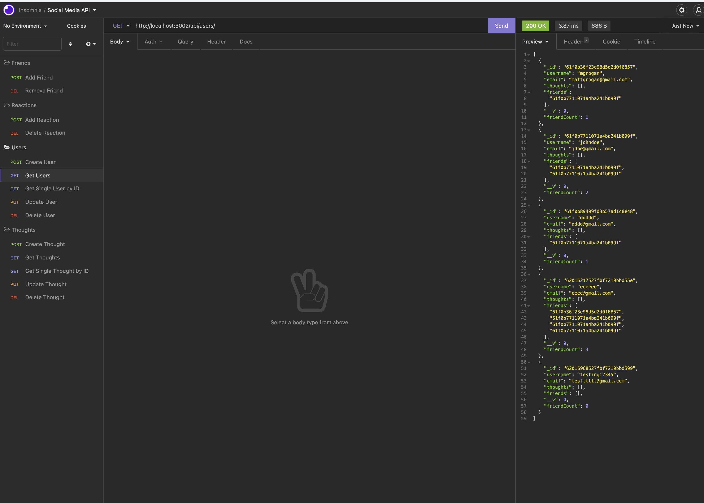

  Social Network API 

## Description

In this homework assignment I built an API for a social network web application using MongoDB and the Mongoose ODM.

## Table of Contents

- [Usage](#usage)
- [Repository-Link](#repository-link)
- [Media](#media)
- [Questions](#questions)
- [License](#license)

## Usage

Open whatever API client you use to test the routes shown in userRoutes and thoughtRoutes.

## Repository-Link

[GitHub Repo Link](https://github.com/mattgrogandev/social-network-api)

## Media

[Walkthrough Video](https://watch.screencastify.com/v/6u54xRHvzCjoFYuUCxNm)

## Questions

If you have any questions regarding this project please contact either on GitHub or by Email below.

GitHub: [mattgrogandev](https://github.com/mattgrogandev)

Email: mattgrogan.dev@gmail.com

## License

Licensed under the MIT license.

[Link to opensource.org license info](https://opensource.org/licenses/MIT)
